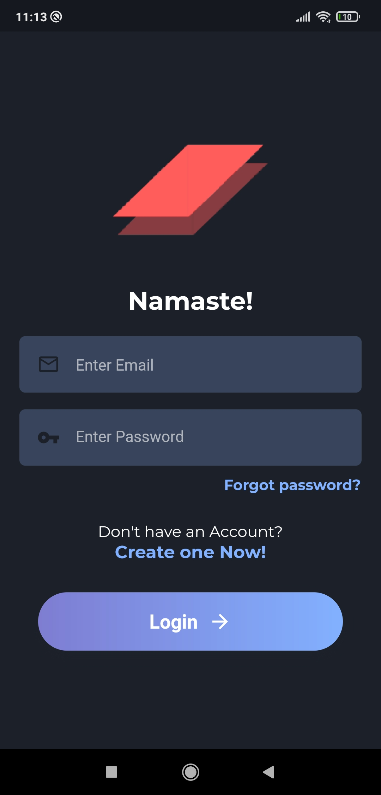

# CODECARDS
CodeCards is a cross platform application for solving data structures and algorithm based questions. The users can bookmark questions, add notes, look for hints to a question and share them. Apart from these functions codecards comes bundled with other intersting fetures as well, such as looking for competitive coding contest timelines, setting daily reminders so that you don't miss a day in your preparation. Also it supports dark theme as you like. 

##### Link to CodeCards Server: https://github.com/ishitb/Code_Cards_Server

## Tech Stack

| Target | Stack | Language |
| ------ | ------ | ------ | 
| Front-end | Flutter | Dart |
| Backend | Django | Python |

# Feature List

  - Swipe questions to bookmark or skip
  - Add notes
  - Share questions
  - Take some hints
  - Look for competitive coding contest details
  - Switch b/w dark and light themes
  - Switch b/w different colorful themes
  - Change Avatars
  - Some other important and mandatory features

## Sneak Peek

   
   

> The app comes bundled with fluid animations and
> easy to understand UI.  

### Installation
Clone the repository and run using an android emulator or a real device. Note that currently the app runs only on android and needs some settings to run in an iOS.
This project works on Flutter version 1.26.0-2.0.pre.157 on • channel master and dart version: 2.12.0.

# Getting Started

A few resources to get you started if this is your first Flutter project:

- [Lab: Write your first Flutter app](https://flutter.dev/docs/get-started/codelab)
- [Cookbook: Useful Flutter samples](https://flutter.dev/docs/cookbook)

For help getting started with Flutter, view flutter's
[online documentation](https://flutter.dev/docs), which offers tutorials,
samples, guidance on mobile development, and a full API reference.
